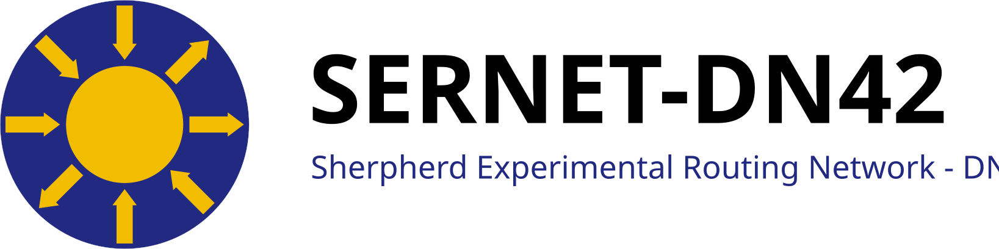

---

SERNET-DN42 是一个全球运作的 DN42 网络。

SERNET-DN42 is a globally operating DN42 network.

AS Number：4242423947

[maintenance information of SERNET-DN42 (EN ONLY)](https://maintenance.sherpherd.net)

---

不知道什么是 DN42 并且有加入的意向？[请跳转到这里。](#dn42-101)

Don't know what DN42 is and have will to joining in? [Click here.](#dn42-101)

### 目录（Table of Contents）
---
* [站点地图（Site Map）](#site-map)
* [站点列表（Site List）](#site-list-cn)[CN](#site-list-cn) \| [EN](#site-list-en)
* [默认对等策略（Default Peering Policy）](#default-peering-policy)
* [不支持跨地域连接的区域列表（The list of regions unsupported inter-region connection）](#region-list-cn)[CN](#region-list-cn) \| [EN](#region-list-en)
  * [例外情况（Exceptions）](#exceptions)
* [路由策略（Routing Policy）](#routing-policy)
* [SVGs](#svg)
* [DN42 101](#dn42-101)
* [相关链接](#related-links)

### 站点地图（Site Map）

---

 
 

### 站点列表　｜　[EN](#site-list-en)
---
默认情况下，公网终结点的端口号为20000+(你的ASN的后4位)。

假如你的 ASN 为 4242420001 ，则我会默认将与你互联的 Wireguard 接口的侦听端口设定为 20001 。

**如果节点为 NAT 节点，则不适用该规则，端口号将另行告知。**

<table style="font-size: 0.8rem; line-height:2.0">
    <thead style="font-weight: bold;line-height:4.0">
        <td>节点名称</td>
        <td>位置</td>
        <td>公网终结点</td>
        <td>隧道地址</td>
        <td>公钥</td>
        <td>支持特性</td>
        <td>支持的连接方式</td>
        <td>对等策略</td>
        <td>路由策略</td>
        <td>带宽</td>
    </thead>
    <tr>
        <td>hkg1.sherpherd.dn42</td>
        <td>香港</td>
        <td>hkg1.sherpherd.net</td>
        <td>172.20.209.65, fe80::3947:1</td>
        <td>Lz/SPcnKfbp4Z6LW7gysFxhyJXfyoett18r3kvlZcBY=</td>
        <td>Extended Nexthop, MP-BGP</td>
        <td>Wireguard, Plain GRE/GRETAP</td>
        <td>默认</td>
        <td>默认</td>
        <td>30Mbps</td>
    </tr>
    <tr>
        <td><del>hk2.sherpherd.dn42</del></td>
        <td><del>香港</del></td>
        <td><del>hk2.sherpherd.net</del></td>
        <td><del>172.20.209.69, fe80::3947:2</del></td>
        <td><del>rCWl5DVwf2C1VpOjdAX16rS9zriDGmHFKiYIcYdOuTk=</del></td>
        <td><del>Extended Nexthop, MP-BGP</del></td>
        <td><del>Wireguard, Plain GRE/GRETAP</del></td>
        <td><del>默认</del></td>
        <td><del>默认</del></td>
        <td><del>300Mbps</del></td>
    </tr>
    <tr>
        <td>sjc1.sherpherd.dn42</td>
        <td>美国，加州，圣何塞</td>
        <td>sjc1.sherpherd.net</td>
        <td>172.20.209.81, fe80::3947:4</td>
        <td>2bQVZJjhIEaEelqwaQ+tbWDERbXjtXyidvYQL5COxyo=</td>
        <td>Extended Nexthop, MP-BGP</td>
        <td>Wireguard, Plain GRE/GRETAP</td>
        <td>默认</td>
        <td>默认</td>
        <td>10Gbps</td>
    </tr>
    <tr>
        <td>fra1.sherpherd.dn42</td>
        <td>德国，法兰克福</td>
        <td>FRA1.sherpherd.net</td>
        <td>172.20.209.89, fe80::3947:6</td>
        <td>KCd+kXNhe48hwOWng77V9E94PszQBqQvJW42c1P+6nk=</td>
        <td>Extended Nexthop, MP-BGP</td>
        <td>Wireguard, Plain GRE/GRETAP</td>
        <td>默认</td>
        <td>默认</td>
        <td>10Gbps</td>
    </tr>
    <tr>
        <td>yukisino-ix-de.sherpherd.dn42</td>
        <td>德国，法兰克福</td>
        <td>N/A</td>
        <td>fd42:23eb:6cf:1103:1266:6aff:fe1f:6cb7, 2a14:ae00:55:2466:1266:6aff:fe1f:6cb7 ,fe80::1266:6aff:fef3:fd8a</td>
        <td>N/A</td>
        <td>Extended Nexthop, MP-BGP</td>
        <td>IX LAN Private Peering</td>
        <td>默认</td>
        <td>默认</td>
        <td>1Gbps</td>
    </tr>
    <tr>
        <td>buf1.sherpherd.dn42</td>
        <td>美国，纽约州，水牛城</td>
        <td>buf1.sherpherd.net</td>
        <td>172.20.209.83, fe80::3947:7</td>
        <td>PXkGrHooCFnB6N8bD6isgVjhl9GvzD2CLqlA+e2XikM=</td>
        <td>Extended Nexthop, MP-BGP</td>
        <td>Wireguard, Plain GRE/GRETAP</td>
        <td>默认</td>
        <td>默认</td>
        <td>1Gbps</td>
    </tr>
    <tr>
        <td>can1.sherpherd.dn42</td>
        <td>广东，广州</td>
        <td>can1.sherpherd.net</td>
        <td>172.20.209.97, fe80::3947:3</td>
        <td>xFmYjFSIL9ycKnba8IgDj8Nu0c+Q8681kwseeql5mmY=</td>
        <td>Extended Nexthop, MP-BGP</td>
        <td>Wireguard, Plain GRE/GRETAP</td>
        <td>选择性， 只与中国大陆地区节点互联</td>
        <td>默认</td>
        <td>200Mbps</td>
    </tr>
    <tr>
        <td>tyo1.sherpherd.dn42</td>
        <td>日本，东京</td>
        <td>tyo1.sherpherd.net</td>
        <td>172.20.209.67, fe80::3947:9</td>
        <td>qwrsDI3bkHDOXUldYGJPSM3hTI7KqDpYbNMzKzB1Uko=</td>
        <td>Extended Nexthop, MP-BGP</td>
        <td>Wireguard, Plain GRE/GRETAP</td>
        <td>默认</td>
        <td>默认</td>
        <td>2.5Gbps</td>
    </tr>
    <tr>
        <td>scix-us.sherpherd.dn42</td>
        <td>美国，加州，圣何塞</td>
        <td>scix-us.sherpherd.net</td>
        <td>172.20.209.85, fe80::3947:13</td>
        <td>ZAs06AprBtUL8BNUhAw0Nj/VN3Mevv9ZEitq4hqteHA=</td>
        <td>Extended Nexthop, MP-BGP</td>
        <td><b><a href="https://scix.luotianyi.us/">SCIX</a> LAN</b> (Address: 2a14:67c1:b4ed:3947::1), Wireguard</td>
        <td>默认</td>
        <td>默认</td>
        <td>1Gbps</td>
    </tr>
    <tr>
        <td>ctu1.sherpherd.dn42</td>
        <td>四川，成都</td>
        <td>ctu1.sherpherd.net</td>
        <td>172.20.209.99, fe80::3947:10</td>
        <td>GRqQrHmntdPRsh43/7wlQxoGmDH26zoq6w9ouhg6ngc=</td>
        <td>Extended Nexthop, MP-BGP</td>
        <td>Wireguard, Plain GRE/GRETAP</td>
        <td>选择性， 只与中国大陆地区节点互联</td>
        <td>默认</td>
        <td>3Mbps</td>
    </tr>
    <tr>
        <td>wds1.sherpherd.dn42</td>
        <td>十堰，湖北</td>
        <td>wds1.sherpherd.net (NAT 节点)</td>
        <td>172.20.209.103, fe80::3947:15</td>
        <td>MEyUcsmjDmMzaiT2DTo1YsIk9WTdl6F0fly39YK1Zkc=</td>
        <td>Extended Nexthop, MP-BGP</td>
        <td>Wireguard</td>
        <td>选择性， 只与中国大陆地区节点互联</td>
        <td>默认</td>
        <td>15Mbps</td>
    </tr>
    <tr>
        <td><del>het1.sherpherd.dn42</del></td>
        <td><del>呼和浩特，内蒙古</del></td>
        <td><del>het1.sherpherd.net</del></td>
        <td><del>172.20.209.101, fe80::3947:14</del></td>
        <td><del>vZZJQSba/JmQ5uospwrk0mLbRMVQsGqhzBPmvIxPWwM=</del></td>
        <td><del>Extended Nexthop, MP-BGP</del></td>
        <td><del>Wireguard, Plain GRE/GRETAP</del></td>
        <td><del>选择性， 只与中国大陆地区节点互联</del></td>
        <td><del>默认</del></td>
        <td><del>30Mbps</del></td>
    </tr>
    <tr>
        <td>sin1.sherpherd.dn42</td>
        <td>新加坡</td>
        <td>sin1.sherpherd.net</td>
        <td>172.20.209.69, fe80::3947:11</td>
        <td>IeHstvM2q89FAZYCmpotG6VTWPyhAMM+bJH756jJDnk=</td>
        <td>Extended Nexthop, MP-BGP</td>
        <td>Wireguard, Plain GRE/GRETAP</td>
        <td>默认</td>
        <td>默认</td>
        <td>5Gbps</td>
    </tr>
    <tr>
        <td><s>tr1.sherpherd.dn42</s></td>
        <td><s>土耳其，伊斯坦布尔</s></td>
        <td><s>tr1.sherpherd.net (NAT 节点)</s></td>
        <td><s>172.20.209.91, fe80::3947:12</s></td>
        <td><s>G5lpWvaVOSeqONoAaizNV26vI0a5KRXIDHqzaBaxiT0=</s></td>
        <td><s>Extended Nexthop, MP-BGP</s></td>
        <td><s>Wireguard</s></td>
        <td><s>默认</s></td>
        <td><s>默认</s></td>
        <td><s>100Mbps</s></td>
    </tr>
    <tr>
        <td>dfw1.sherpherd.dn42</td>
        <td>美国，德州，达拉斯</td>
        <td>dfw1.sherpherd.net (IPv6 / IPv4 NAT64)</td>
        <td>172.20.209.87, fe80::3947:16</td>
        <td>mM+ZBtcpVC1iyU8Wvgzrum1BPvRlRLT1oayONak+pl0=</td>
        <td>Extended Nexthop, MP-BGP</td>
        <td>Wireguard, Plain GRE/GRETAP</td>
        <td>默认</td>
        <td>默认</td>
        <td>1Gbps</td>
    </tr>
    <tr>
        <td>cgk1.sherpherd.dn42</td>
        <td>印尼，雅加达</td>
        <td>cgk1.sherpherd.net (NAT IPv4 / HE IPv6)</td>
        <td>172.20.209.71, fe80::3947:215</td>
        <td>MsTlrGBx9bj0/Jb/G/AowmkJVYr1joyo3RlysEoz8V8=</td>
        <td>Extended Nexthop, MP-BGP</td>
        <td>Wireguard</td>
        <td>默认</td>
        <td>默认</td>
        <td>200Mbps</td>
    </tr>
    <tr>
        <td>azj1.sherpherd.dn42</td>
        <td>江苏，镇江</td>
        <td>azj1.sherpherd.net（NAT IPv4）</td>
        <td>172.20.209.104, fe80::3947:17</td>
        <td>ryh+1ghdLm1IRCRnKGDcbvuOfttfUs0fd8uKZN7R6H0=</td>
        <td>Extended Nexthop, MP-BGP</td>
        <td>Wireguard</td>
        <td>选择性， 只与中国大陆地区节点互联</td>
        <td>默认</td>
        <td>30Mbps</td>
    </tr>
</table>

---

### Site List　｜　[CN](#site-list-cn)
---
By default, the port number of clearnet endpoint equals to 20000+(last 4 digits of your ASN)

For example, if you have your ASN 4242420001, I'll set listen port 20001 on the Wireguard interface towards to you.

**This does not apply to NAT nodes, port number of NAT nodes will be provided separately.**

<table style="font-size: 0.8rem">
    <thead style="font-weight: bold">
        <td>Node Name</td>
        <td>Location</td>
        <td>Clearnet Endpoint</td>
        <td>Tunnel Addresses</td>
        <td>Public Key</td>
        <td>Supported Features</td>
        <td>Supported Connection Method</td>
        <td>Peering Policy</td>
        <td>Routing Policy</td>
        <td>Bandwidth</td>
    </thead>
    <tr>
        <td>hkg1.sherpherd.dn42</td>
        <td>Hong Kong, China</td>
        <td>hkg1.sherpherd.net</td>
        <td>172.20.209.65, fe80::3947:1</td>
        <td>Lz/SPcnKfbp4Z6LW7gysFxhyJXfyoett18r3kvlZcBY=</td>
        <td>Extended Nexthop, MP-BGP</td>
        <td>Wireguard, Plain GRE/GRETAP</td>
        <td>Default</td>
        <td>Default</td>
        <td>30Mbps</td>
    </tr>
    <tr>
        <td><del>hk2.sherpherd.dn42</del></td>
        <td><del>Hong Kong, China</del></td>
        <td><del>hk2.sherpherd.net</del></td>
        <td><del>172.20.209.69, fe80::3947:2</del></td>
        <td><del>rCWl5DVwf2C1VpOjdAX16rS9zriDGmHFKiYIcYdOuTk=</del></td>
        <td><del>Extended Nexthop, MP-BGP</del></td>
        <td><del>Wireguard, Plain GRE/GRETAP</del></td>
        <td><del>Default</del></td>
        <td><del>Default</del></td>
        <td><del>300Mbps</del></td>
    </tr>
    <tr>
        <td>sjc1.sherpherd.dn42</td>
        <td>San Jose, CA, United States</td>
        <td>sjc1.sherpherd.net</td>
        <td>172.20.209.81, fe80::3947:4</td>
        <td>2bQVZJjhIEaEelqwaQ+tbWDERbXjtXyidvYQL5COxyo=</td>
        <td>Extended Nexthop, MP-BGP</td>
        <td>Wireguard, Plain GRE/GRETAP</td>
        <td>Default</td>
        <td>Default</td>
        <td>10Gbps</td>
    </tr>
    <tr>
        <td>fra1.sherpherd.dn42</td>
        <td>Frankfurt, Germany</td>
        <td>fra1.sherpherd.net</td>
        <td>172.20.209.89, fe80::3947:6</td>
        <td>KCd+kXNhe48hwOWng77V9E94PszQBqQvJW42c1P+6nk=</td>
        <td>Extended Nexthop, MP-BGP</td>
        <td>Wireguard, Plain GRE/GRETAP</td>
        <td>Default</td>
        <td>Default</td>
        <td>10Gbps</td>
    </tr>
    <tr>
        <td>yukisino-ix-de.sherpherd.dn42</td>
        <td>Frankfurt, Germany</td>
        <td>N/A</td>
        <td>fd42:23eb:6cf:1103:1266:6aff:fe1f:6cb7, 2a14:ae00:55:2466:1266:6aff:fe1f:6cb7 ,fe80::1266:6aff:fef3:fd8a</td>
        <td>N/A</td>
        <td>Extended Nexthop, MP-BGP</td>
        <td>IX LAN Private Peering</td>
        <td>Default</td>
        <td>Default</td>
        <td>1Gbps</td>
    </tr>
    <tr>
        <td>buf1.sherpherd.dn42</td>
        <td>Buffalo, NY, United States</td>
        <td>buf1.sherpherd.net</td>
        <td>172.20.209.83, fe80::3947:7</td>
        <td>PXkGrHooCFnB6N8bD6isgVjhl9GvzD2CLqlA+e2XikM=</td>
        <td>Extended Nexthop, MP-BGP</td>
        <td>Wireguard, Plain GRE/GRETAP</td>
        <td>Default</td>
        <td>Default</td>
        <td>1Gbps</td>
    </tr>
    <tr>
        <td>can1.sherpherd.dn42</td>
        <td>Guangzhou, Guangdong, China</td>
        <td>can1.sherpherd.net</td>
        <td>172.20.209.97, fe80::3947:3</td>
        <td>xFmYjFSIL9ycKnba8IgDj8Nu0c+Q8681kwseeql5mmY=</td>
        <td>Extended Nexthop, MP-BGP</td>
        <td>Wireguard, Plain GRE/GRETAP</td>
        <td>Selective, only available for who has existing DN42 node in China Mainland</td>
        <td>Default</td>
        <td>200Mbps</td>
    </tr>
    <tr>
        <td>tyo1.sherpherd.dn42</td>
        <td>Tokyo, Japan</td>
        <td>tyo1.sherpherd.net</td>
        <td>172.20.209.67, fe80::3947:9</td>
        <td>qwrsDI3bkHDOXUldYGJPSM3hTI7KqDpYbNMzKzB1Uko=</td>
        <td>Extended Nexthop, MP-BGP</td>
        <td>Wireguard, Plain GRE/GRETAP</td>
        <td>Default</td>
        <td>Default</td>
        <td>2.5Gbps</td>
    </tr>
    <tr>
        <td>scix-us.sherpherd.dn42</td>
        <td>San Jose, CA, United States</td>
        <td>scix-us.sherpherd.net</td>
        <td>172.20.209.85, fe80::3947:13</td>
        <td>ZAs06AprBtUL8BNUhAw0Nj/VN3Mevv9ZEitq4hqteHA=</td>
        <td>Extended Nexthop, MP-BGP</td>
        <td><b><a href="https://scix.luotianyi.us/">SCIX</a> LAN</b> (Address: 2a14:67c1:b4ed:3947::1), Wireguard</td>
        <td>Default</td>
        <td>Default</td>
        <td>1Gbps</td>
    </tr>
    <tr>
        <td>ctu1.sherpherd.dn42</td>
        <td>Chengdu, Sichuan, China</td>
        <td>ctu1.sherpherd.net (NAT node)</td>
        <td>172.20.209.99, fe80::3947:10</td>
        <td>GRqQrHmntdPRsh43/7wlQxoGmDH26zoq6w9ouhg6ngc=</td>
        <td>Extended Nexthop, MP-BGP</td>
        <td>Wireguard, Plain GRE/GRETAP</td>
        <td>Selective, only available for who has existing DN42 node in China Mainland</td>
        <td>Default</td>
        <td>3Mbps</td>
    </tr>
    <tr>
        <td>wds1.sherpherd.dn42</td>
        <td>Shiyan, Hubei, China</td>
        <td>wds1.sherpherd.net (NAT Node)</td>
        <td>172.20.209.103, fe80::3947:15</td>
        <td>MEyUcsmjDmMzaiT2DTo1YsIk9WTdl6F0fly39YK1Zkc=</td>
        <td>Extended Nexthop, MP-BGP</td>
        <td>Wireguard</td>
        <td>Selective, only available for who has existing DN42 node in China Mainland</td>
        <td>Default</td>
        <td>15Mbps</td>
    </tr>
    <tr>
        <td><del>het1.sherpherd.dn42</del></td>
        <td><del>Hohhot, Inner Mongolia, China</del></td>
        <td><del>het1.sherpherd.net</del></td>
        <td><del>172.20.209.101, fe80::3947:14</del></td>
        <td><del>vZZJQSba/JmQ5uospwrk0mLbRMVQsGqhzBPmvIxPWwM=</del></td>
        <td><del>Extended Nexthop, MP-BGP</del></td>
        <td><del>Wireguard, Plain GRE/GRETAP</del></td>
        <td><del>Selective, only available for who has existing DN42 node in China Mainland</del></td>
        <td><del>Default</del></td>
        <td><del>30Mbps</del></td>
    </tr>
    <tr>
        <td>sin1.sherpherd.dn42</td>
        <td>Singapore</td>
        <td>sin1.sherpherd.net</td>
        <td>172.20.209.69, fe80::3947:11</td>
        <td>IeHstvM2q89FAZYCmpotG6VTWPyhAMM+bJH756jJDnk=</td>
        <td>Extended Nexthop, MP-BGP</td>
        <td>Wireguard, Plain GRE/GRETAP</td>
        <td>Default</td>
        <td>Default</td>
        <td>5Gbps</td>
    </tr>
    <tr>
        <td></s>tr1.sherpherd.dn42</s></td>
        <td></s>Istanbul, Turkey</s></td>
        <td></s>tr1.sherpherd.net (NAT Node)</s></td>
        <td></s>172.20.209.91, fe80::3947:12</s></td>
        <td></s>G5lpWvaVOSeqONoAaizNV26vI0a5KRXIDHqzaBaxiT0=</s></td>
        <td></s>Extended Nexthop, MP-BGP</s></td>
        <td></s>Wireguard</s></td>
        <td></s>Default</s></td>
        <td></s>Default</s></td>
        <td></s>100Mbps</s></td>
    </tr>
    <tr>
        <td>dfw1.sherpherd.dn42</td>
        <td>Dallas, TX, United States</td>
        <td>dfw1.sherpherd.net (IPv6 / IPv4 NAT64)</td>
        <td>172.20.209.87, fe80::3947:16</td>
        <td>mM+ZBtcpVC1iyU8Wvgzrum1BPvRlRLT1oayONak+pl0=</td>
        <td>Extended Nexthop, MP-BGP</td>
        <td>Wireguard, Plain GRE/GRETAP</td>
        <td>Default</td>
        <td>Default</td>
        <td>1Gbps</td>
    </tr>
    <tr>
        <td>cgk1.sherpherd.dn42</td>
        <td>Jakarta, Indonesia</td>
        <td>cgk1.sherpherd.net (NAT IPv4 / HE IPv6)</td>
        <td>172.20.209.71, fe80::3947:215</td>
        <td>MsTlrGBx9bj0/Jb/G/AowmkJVYr1joyo3RlysEoz8V8=</td>
        <td>Extended Nexthop, MP-BGP</td>
        <td>Wireguard, Plain GRE/GRETAP</td>
        <td>Default</td>
        <td>Default</td>
        <td>200Mbps</td>
    </tr>
    <tr>
        <td>azj1.sherpherd.dn42</td>
        <td>Zhenjiang, Jiansu, China</td>
        <td>azj1.sherpherd.net（NAT IPv4）</td>
        <td>172.20.209.104, fe80::3947:17</td>
        <td>ryh+1ghdLm1IRCRnKGDcbvuOfttfUs0fd8uKZN7R6H0=</td>
        <td>Extended Nexthop, MP-BGP</td>
        <td>Wireguard</td>
        <td>Selective, only available for who has existing DN42 node in China Mainland</td>
        <td>Default</td>
        <td>30Mbps</td>
    </tr>
</table>

 
 

### 默认对等策略（Default Peering Policy）
---
对除了处于“不支持跨地域连接的区域列表”以外的任意延迟合适（<=80ms）的节点开放连接。

Accept peering with any node have reasonable latency (<=80ms) except those nodes which in the region listed in "The list of regions unsupported inter-region connection".

### 不支持跨地域连接的区域列表　｜　[EN](#region-list-en)
---
* 中国大陆地区（单独列出的例外情况除外）
* 中东地区（单独列出的例外情况除外）
* 俄罗斯联邦远东地区（单独列出的例外情况除外）
* 非洲（单独列出的例外情况除外）
* 南美（单独列出的例外情况除外）
* 关岛
* 古巴
* 朝鲜民主主义人民共和国（朝鲜，北朝鲜）
* 南极洲
* 太空中的任何人造物体（举例，国际空间站）
* 水星
* 金星
* 月球
* 火星
* 木星
* 土星
* 天王星
* 海王星
* 冥王星
* 其它位于太阳系的卫星
* 太阳系之外的任何地方
* 2020年代之前的地球

### The list of regions unsupported inter-region connection　｜　[CN](#region-list-cn)
---
* China Mainland (Except the stated exceptions)
* Middle East (Except the stated exceptions)
* Far East of Russia Federation
* Africa (Except the stated exceptions)
* South America (Except the stated exceptions)
* Guam
* Cuba
* Democratic People's Republic of Korea (DPRK, aka North Korea)
* Antarctica
* Any human-made objects in space (For example, ISS)
* Mercury
* Venus
* Moon
* Mars
* Jupiter
* Saturn
* Uranus
* Neptune
* Pluto
* Other satellites in solar system
* Anywhere outside the solar system
* The earth before 2020s

#### 例外情况（Exceptions）
---
* 使用 IPLC 等方式拥有与你想要连接的 SERNET-DN42 节点同一地域的 IP 地址且延迟可以接受。（Use methods like IPLC to obtain an availiable IP address in same region of the one SERNET-DN42 node you want to peer with, and the latency is also reasonable.）

 
 

### 路由策略（Routing Policy）
---
SERNET-DN42 的默认路由策略为 Hot-Potato Routing。这是 BGP 的默认路由策略，选取 AS-PATH 最短的路径，在此基础上尽可能使用 EBGP 路由。

而对于带有地域团体属性的路由，SERNET-DN42 采取 Cold-Potato Routing 的策略。尽可能将报文在自治系统内部传输，以期求基于地域的更优的流量路径。

The default routing policy of SERNET-DN42 is Hot-Potato Routing. This is the default routing policy of BGP, choose the path with shortest AS-PATH, and use EBGP route as much as possible on this basis. 

For those routes with region communities, SERNET-DN42 take Cold-Potato Routing policy. Transmit the packet within AS as much as possible to optimize the traffic path based on region.

 
 

### DN42 101
---
* DN42 介绍（Introduction of DN42）[CN](2023/05/30/Introduction-of-DN42_cn) \| [EN](2023/05/30/Introduction-of-DN42_en)
* (WIP) 注册 DN42 网络信息（DN42 Network Information Registry）CN \| EN
* (WIP) DN42 节点基本设置（DN42 Node Basic Setup）CN \| EN
* (WIP) 寻找 Peer（Find Peer）CN \| EN
* (WIP) 设置 Peer（Setup Peer）CN \| EN
* (WIP) 内部互联设置（Setup Internal Peer）CN \| EN

 
 

### SVGs
---
[SERNET-DN42 logo](img/sernet-logo-small.svg)

[SERNET-DN42 logo large (Light)](img/sernet-logo-large-alt1.svg)

[SERNET-DN42 logo large (Dark)](img/sernet-logo-large.svg)

 
 

### 相关链接（Related Links）
---
[DN42 Wiki](https://dn42.dev/Home)

[maintenance Information](https://maintenance.sherpherd.net)

[SERNET-MNT](https://explorer.dn42.dev/#/SERNET-MNT)

[SERNET-IX](ix.html)
